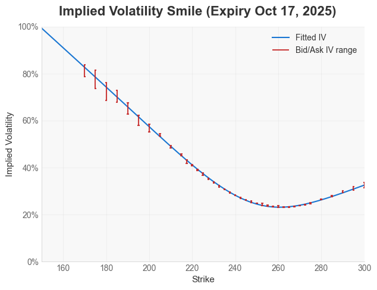
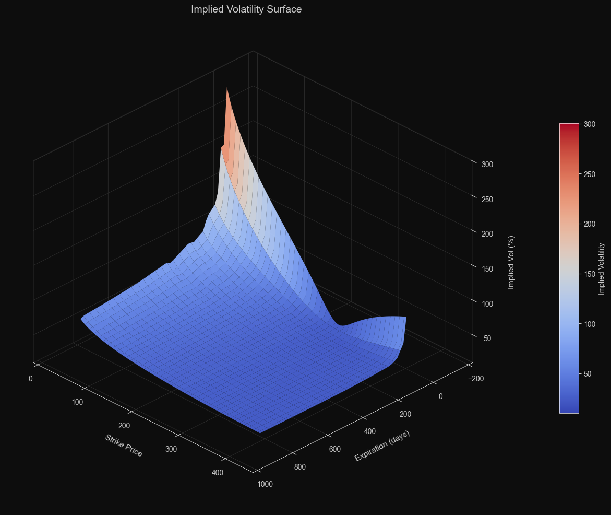
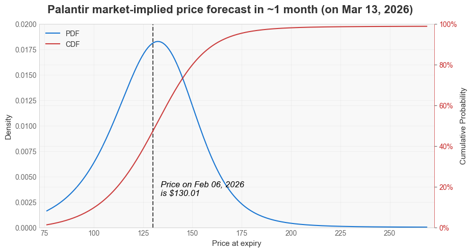
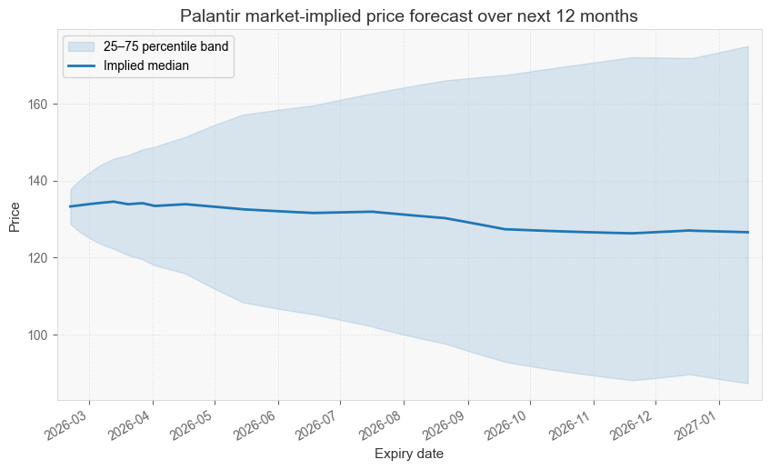

[](https://pypi.org/project/oipd/)
[](https://colab.research.google.com/github/tyrneh/options-implied-probability/blob/main/examples/OIPD_colab_demo.ipynb)
[](https://discord.gg/NHxWPGhhSQ)
[](https://pepy.tech/projects/oipd)

# Overview

### OIPD (Options-implied Probability Distribution) provides 2 capabilities:

**1. Compute market-implied probability distributions of future asset prices.**
   - While markets don't predict the future with certainty, under the efficient market view, these market expectations represent the best available estimate of what might happen.

<p align="center" style="margin-top: 80px;">
  
</p>

**2. Fit arbitrage-free volatility smiles and surfaces for pricing and risk analysis.**
   - Fitting a vol surface well is a complex and expensive process, with the leading software provider costing $50k USD/month/seat. OIPD open-sources the entire pipeline fairly rigorously, with further improvements in the roadmap.

<table align="center" cellspacing="12" style="margin-top:120px; width:100%; border-collapse:separate;">
  <tr>
    <td style="width:50%; border:5px solid #000;">
      
    </td>
    <td style="width:50%; border:5px solid #000;">
      
    </td>
  </tr>
</table>


# Quick start

## 1. Installation
```bash
pip install oipd
```

## 2. Mental model for using OIPD

> [!TIP]
> If you only care about probability and do not want to manage volatility fitting directly, jump to [Section 3: Quickstart tutorial in computing market-implied probability distributions](#3-quickstart-tutorial-in-computing-market-implied-probability-distributions) and use `ProbCurve.from_chain(...)` or `ProbSurface.from_chain(...)`.

<br>

OIPD has four core objects. A simple way to remember them is a matrix:

| Scope | Volatility Layer | Probability Layer |
| --- | --- | --- |
| Single expiry | `VolCurve` | `ProbCurve` |
| Multiple expiries | `VolSurface` | `ProbSurface` |

You can think about the lifecycle in three steps:

1. Initialize the estimator object with configuration.
2. Call `.fit(chain, market)` to calibrate.
3. Query/plot the fitted object, or convert from vol to probability via `.implied_distribution()`.

If you're familiar with scikit-learn, this is the same mental model: configure an estimator, call `fit`, then inspect outputs.

Conceptual flow:

```text
Step 1: Fit volatility
  VolCurve / VolSurface object
      + options chain + market inputs
      -> .fit(...)
      -> fitted VolCurve / VolSurface object (IV, prices, greeks, diagnostics)

Step 2: Convert fitted volatility to probability
  fitted VolCurve / VolSurface
      -> .implied_distribution()
      -> ProbCurve / ProbSurface object (PDF, CDF, quantiles, moments)
```

## 3. Quickstart tutorial in computing market-implied probability distributions

This quickstart will cover the functionality in **(1) computing market-implied probabilities**. See the [included jupyter notebook ](examples/quickstart_yfinance.ipynb) for a full example on using the automated yfinance connection to download options data and compute market-implied probabilities for Palantir. 

For a more technical tutorial including the functionality of **(2) volatility fitting, see the additional jupyter notebooks** in the [examples](examples/) directory, as well as the full documentation. 

### 3A. Usage for computing a probability distribution on a specific future date

```python
import matplotlib.pyplot as plt

from oipd import MarketInputs, ProbCurve, sources

# 1. we download data using the built-in yfinance connection
ticker = "AAPL"                               # specify the stock ticker
expiries = sources.list_expiry_dates(ticker)  # see all expiry dates
single_expiry = expiries[1]                   # select one of the expiry dates you're interested in 

chain, snapshot = sources.fetch_chain(ticker, expiries=single_expiry) # download the options chain data, and a snapshot at the time of download

# 2. fill in the parameters 
market = MarketInputs(
    valuation_date=snapshot.date,               # date on which the options data was downloaded
    underlying_price=snapshot.underlying_price, # the price of the underlying stock at the time when the options data was downloaded 
    risk_free_rate=0.04,                        # the risk-free rate of return. Use the US Fed or Treasury yields that are closest to the horizon of the expiry date
)

# 3. compute the future probability distribution using the data and parameters
prob = ProbCurve.from_chain(chain, market)

# 4. query the computed result to understand market-implied probabilities and other statistics
prob.plot()
plt.show()

prob_below = prob.prob_below(100)   # P(price < 100)
prob_above = prob.prob_above(120)   # P(price >= 120)
q50 = prob.quantile(0.50)           # median implied price
skew = prob.skew()                  # skew
```

<p align="center" style="margin-top: 120px;">
  
</p>


### 3B. Usage for computing probabilities over time

```python
import matplotlib.pyplot as plt

from oipd import MarketInputs, ProbSurface, sources

# 1. download multi-expiry data using the built-in yfinance connection
ticker = "AAPL"
chain_surface, snapshot_surface = sources.fetch_chain(
    ticker,
    horizon="3m",  # auto-fetch all listed expiries inside the horizon
)

# 2. fill in the parameters
surface_market = MarketInputs(
    valuation_date=snapshot_surface.date,               # date on which the options data was downloaded
    underlying_price=snapshot_surface.underlying_price, # price of the underlying stock at download time
    risk_free_rate=0.04,                                # risk-free rate for the horizon
)

# 3. compute the probability surface using the data and parameters
surface = ProbSurface.from_chain(chain_surface, surface_market)

# 4. query and visualize the surface
surface.plot_fan() # Plot a fan chart of price probability over time
plt.show()

# 5. "slice" the surface to get a ProbCurve, and query its statistical properties in the same manner as in example A 
surface.expiries                                  # list all the expiry dates that were captured
curve = surface.slice(surface.expiries[0]) # get a slice on the first expiry
curve.prob_below(100)                      # query probabilities and statistics 
curve.kurtosis()                           
```

<p align="center" style="margin-top: 120px;">
  
</p>


OIPD also **supports manual CSV or DataFrame uploads**. 

See [more examples](examples/) for demos.


# Community

Pull requests welcome! Reach out on GitHub issues to discuss design choices.

Join the [Discord community](https://discord.gg/NHxWPGhhSQ) to share ideas, discuss strategies, and get support. Message me with your feature requests, and let me know how you use this. 
