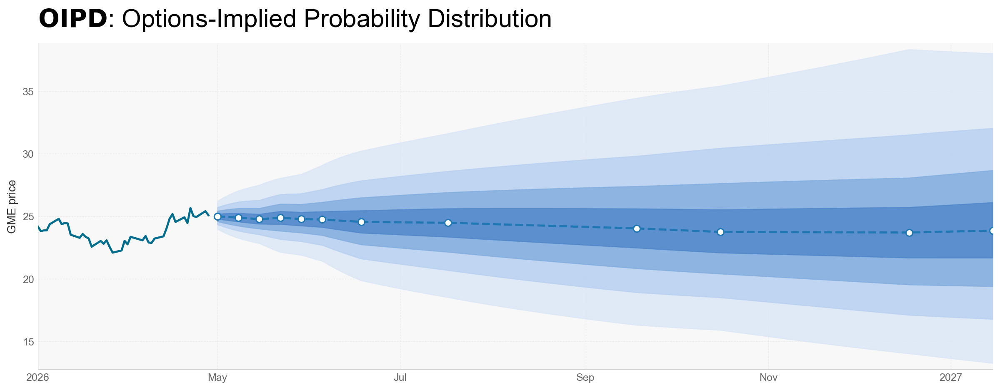
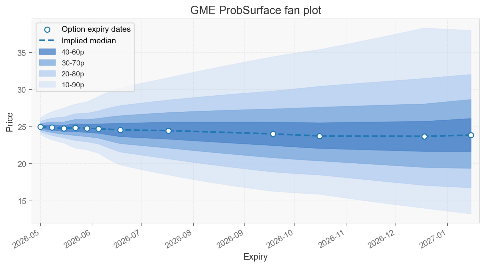
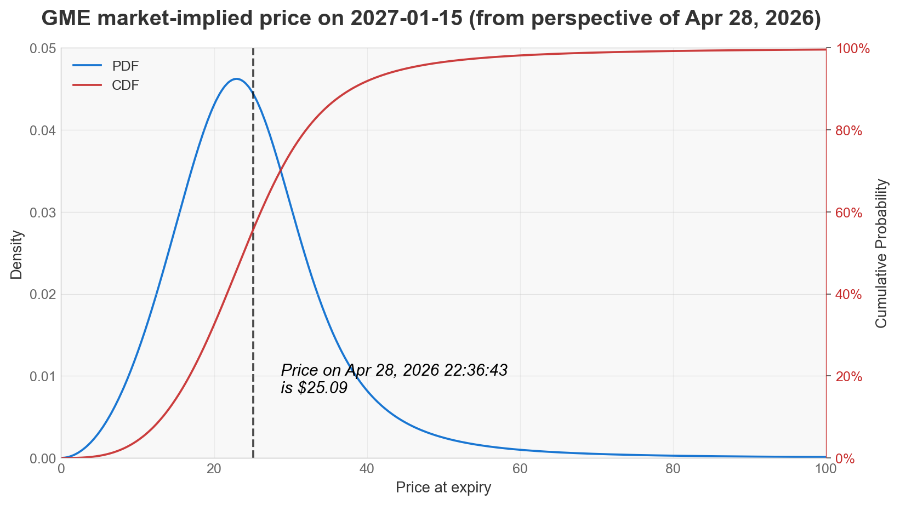

[](https://pypi.org/project/oipd/)
[](https://colab.research.google.com/github/Open-Lemma/options-implied-probability/blob/main/OIPD_Demo.ipynb)
[](https://discord.gg/NHxWPGhhSQ)
[](https://pepy.tech/projects/oipd)

## Overview

OIPD computes the probabilities of an asset's future price as implied by the options market.

It does this by taking listed options data, fitting an arbitrage-free implied volatility surface, and then transforming that fitted object into a probability distribution over future asset prices. In practice, that provides two core capabilities in one library:

- **Volatility modeling:** fit single-expiry smiles and multi-expiry volatility surfaces, and compute greeks. 
- **Probability extraction:** compute market-implied probability distributions, and distribution statistics. 

[**Read the docs**](https://docs.open-lemma.com) · [**Use the web interface**](https://open-lemma.com)

## Quick install

The standard install includes the built-in yfinance data connection.

```bash
pip install oipd
```

## One quick example

Fetch GameStop options across the next twelve months, fit a `VolSurface`, derive a `ProbSurface`, and plot the fan chart.

```python
import matplotlib.pyplot as plt

from oipd import MarketInputs, VolSurface, sources

ticker = "GME"
chain, snapshot = sources.fetch_chain(
    ticker,
    horizon="12m",  # fetch all listed expiries inside the next 12 months
)

market = MarketInputs(
    valuation_date=snapshot.asof,
    underlying_price=snapshot.underlying_price,
    risk_free_rate=0.04,
)

vol_surface = VolSurface().fit(chain, market)
surface = vol_surface.implied_distribution()

fig = surface.plot_fan()
plt.show()
```



`surface.plot_fan()` visualizes the market-implied price distribution across fitted option expiries.

You can also take one expiry from the surface and query it as a `ProbCurve`.

```python
curve = surface.slice(surface.expiries[-1]) # take the furthest date

print(curve.prob_below(25))  # P(GME price < 25) at that expiry
print(curve.quantile(0.50))  # median implied price at that expiry

fig = curve.plot()
fig.axes[0].set_xlim(0, 100)
plt.show()
```



A surface slice returns a `ProbCurve`, so you can inspect one expiry as a standalone probability distribution.

## Example Notebooks

See [more examples](examples/) for demos.

# Community

Pull requests welcome! Reach out on GitHub issues to discuss design choices.

Join the [Discord community](https://discord.gg/NHxWPGhhSQ) to share ideas, discuss strategies, and get support. Message me with your feature requests, and let me know how you use this.

# Contributors

**Thanks to everyone who has contributed code:**

[](https://github.com/Open-Lemma/options-implied-probability/graphs/contributors)

**And special thanks for support on theory, implementation, or advisory:**
- [integral-alpha.com](https://integral-alpha.com)
- Jannic H., Chun H. H., and Melanie C.
- and others who prefer to go unnamed
