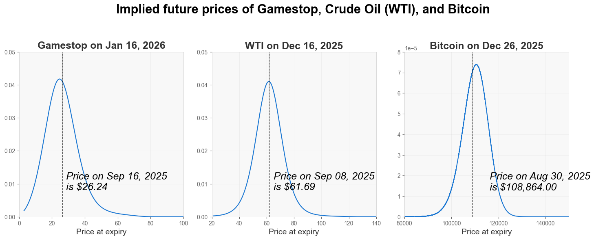

[](https://github.com/ambv/black)

# Overview

OIPD transforms raw options data into probability distributions of future asset prices.

In plain terms: it takes the market's collective expectations embedded in option prices and turns them into a curve that shows the likelihood of different outcomes on a future date — much like a forecast, but for prices.

While markets don't predict the future with certainty, under the efficient market hypothesis, these collective expectations represent the best available estimate of what might happen.

Traditionally, extracting these “risk-neutral densities” required institutional knowledge and resources, limited to specialist quant-desks. OIPD makes this capability accessible to everyone — delivering an institutional-grade tool in a simple, production-ready Python package.

<p align="center" style="margin-top: 80px;">
  
</p>


# Quick start

#### Installation
```bash
pip install oipd
```

#### Usage


```pythongit statu
from oipd import RND, MarketInputs
from datetime import date

# 1 ─ point to a ticker and provide market info
market = MarketInputs(
    valuation_date=date.today(),      # the "as-of" date for the analysis
    expiry_date=date(2025, 12, 19),   # option expiry you care about
    risk_free_rate=0.04,              # risk-free rate (annualized by default)
    # risk_free_rate_mode="continuous"  # set if your input is already continuous
)

# 2 - run estimator, auto fetching data from Yahoo Finance
est = RND.from_ticker("AAPL", market)   

# 3 ─ access results and plots
est.prob_at_or_above(120)               # P(price >= $120)
est.prob_below(100)                     # P(price < $100)
est.plot()                              # plot probability and cumulative distribution functions 
```

OIPD also supports manual CSV or DataFrame uploads. See [`TECHNICAL_README.md`](TECHNICAL_README.md) for more details.


# Use cases

**Retail traders: XYZ**

- XYZ

**Professional managers: Compute your portfolio's forward-looking tail risk ahead of turbulent earnings season**

- Historical view: A 99% 12-month VaR of 3% is backward-looking and assumes a parametric distribution–often unrealistic before catalysts
- Market-implied view: Ahead of earnings and a central-bank meeting, pull option-implied distributions for holdings. The forward-looking, non-parametric distribution point to a 6% portfolio-blended VaR

**Corporates: Decide the next commodity hedge tranche**

- Quantify budget risk: As an airline, a portion of next year’s jet fuel demand is hedged; the rest floats. Use OIPD to estimate the probability of breaching your budget and the expected overspend (earnings-at-risk) on the unhedged slice.
- Adjust hedging coverage when tails fatten: If OIPD shows higher price risk, add a small 5–10% hedged tranche using to pull P(breach)/EaR back within board guardrails

# Key features
1. Foundations in rigourous options-theory 
    - Integrated put-call parity to (1) eliminate noisy data, and (2) infer forward-looking dividends information, no dividend guesswork required from user
    - Black76 pricing engine in forward-space, compatible with equities, futures, and FX asset classes
    - Thoughtfully designed architecture, pluggable pricing models and input parameters, and extensible for future pricing models
2. Ease-of-use conveniences
    - Integration with Yahoo Finance to auto-fetch options data based on a ticker name
    - Integrated results and visualizations 

# License

DISCLAIMER: This software is provided for informational and educational purposes only and does not constitute financial advice. Use it at your own risk. The author is not responsible for any financial losses or damages resulting from its use. Always consult with a qualified financial professional before making any financial decisions.

THE SOFTWARE IS PROVIDED "AS IS", WITHOUT WARRANTY OF ANY KIND, EXPRESS OR IMPLIED, INCLUDING BUT NOT LIMITED TO THE WARRANTIES OF MERCHANTABILITY, FITNESS FOR A PARTICULAR PURPOSE AND NONINFRINGEMENT. IN NO EVENT SHALL THE AUTHORS OR COPYRIGHT HOLDERS BE LIABLE FOR ANY CLAIM, DAMAGES OR OTHER LIABILITY, WHETHER IN AN ACTION OF CONTRACT, TORT OR OTHERWISE, ARISING FROM, OUT OF OR IN CONNECTION WITH THE SOFTWARE OR THE USE OR OTHER DEALINGS IN THE SOFTWARE.
