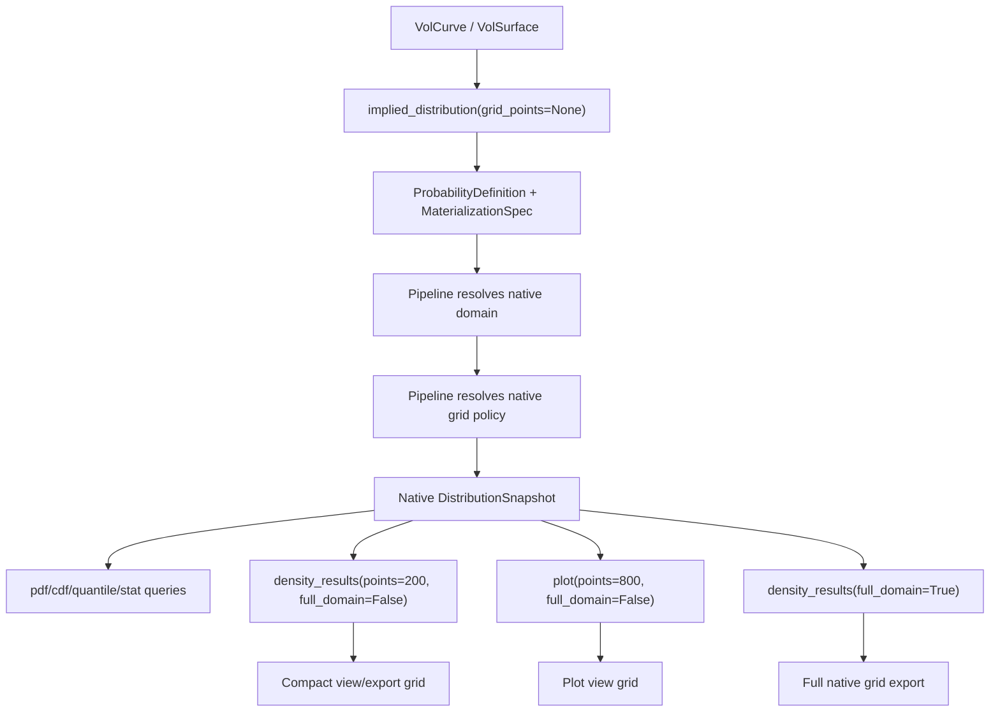

# fix: Separate native and view probability grid resolution

## Overview

Fix the probability plotting-resolution bug by separating two concepts that are
currently entangled:

- Native probability materialization: the internal grid used to compute PDF,
  CDF, quantiles, and statistics.
- View/export resolution: the grid used for plots, DataFrame exports, and
  presentation.

The native grid should be smart by default: when the PDF domain widens to cover
tails, the grid should add enough points to preserve useful price spacing. The
view/export grid should remain intentionally small unless the user explicitly
asks for the full native domain.

## Problem Statement

The adaptive PDF domain can now widen far beyond the market strike range. That
is correct for probability support, but a fixed native grid such as 200 points
can make the spacing too coarse. The plotted PDF then appears jagged or
truncated because the full widened domain is sampled too sparsely.

At the same time, blindly returning the full native domain from
`density_results()` can create large BTC-like DataFrames spanning from near zero
to a far right tail. Native numerical quality and user-facing export size should
therefore be controlled separately.

## Target Architecture



## Public API Policy

Preserve the general API shape. Do not introduce new public result classes or
new public methods. Add arguments only to existing methods.

Recommended public signatures:

```python
VolCurve.implied_distribution(grid_points: int | None = None) -> ProbCurve
VolSurface.implied_distribution(grid_points: int | None = None) -> ProbSurface
ProbSurface(vol_surface: VolSurface, grid_points: int | None = None)

ProbCurve.density_results(
    domain: tuple[float, float] | None = None,
    points: int = 200,
    *,
    full_domain: bool = False,
) -> pd.DataFrame

ProbCurve.plot(
    *,
    kind: Literal["pdf", "cdf", "both"] = "both",
    points: int = 800,
    full_domain: bool = False,
    xlim: tuple[float, float] | None = None,
    ...
) -> Any

ProbSurface.density_results(
    domain: tuple[float, float] | None = None,
    points: int = 200,
    *,
    full_domain: bool = False,
    start: ... = None,
    end: ... = None,
    step_days: int | None = 1,
) -> pd.DataFrame
```

Meaning:

- `grid_points=None`: use smart native grid default.
- `grid_points=int`: user explicitly controls native materialization
  resolution.
- `points`: controls view/export/plot resolution only.
- `full_domain=False`: default compact view/export domain.
- `full_domain=True`: return/resample the full native PDF domain explicitly.
- `xlim`: keeps current plotting behavior and acts as an explicit plot domain.

## Native Grid Policy

Implement this in `oipd/pipelines/probability/rnd_curve.py`, not in
`oipd/core/`. Core remains pure math.

Add constants:

```python
DEFAULT_NATIVE_GRID_MIN_POINTS = 241
DEFAULT_NATIVE_GRID_MAX_POINTS = 2500
DEFAULT_NATIVE_GRID_REL_STEP = 0.005
DEFAULT_NATIVE_GRID_MIN_REL_STEP = 0.001
DEFAULT_NATIVE_GRID_MAX_REL_STEP = 0.02
DEFAULT_NATIVE_GRID_MIN_ABS_STEP = 0.01
DEFAULT_NATIVE_GRID_MARKET_GAP_FRACTION = 0.5
```

Policy formula:

```python
reference_price = max(abs(pricing_underlying), 1.0)
domain_width = resolved_domain[1] - resolved_domain[0]

reference_step = DEFAULT_NATIVE_GRID_REL_STEP * reference_price
min_step = max(DEFAULT_NATIVE_GRID_MIN_ABS_STEP,
               DEFAULT_NATIVE_GRID_MIN_REL_STEP * reference_price)
max_step = DEFAULT_NATIVE_GRID_MAX_REL_STEP * reference_price

observed_gap = median_positive_strike_gap(raw_observed_domain or observed_iv)
if observed_gap is available:
    market_step = DEFAULT_NATIVE_GRID_MARKET_GAP_FRACTION * observed_gap
    target_step = min(reference_step, market_step)
else:
    target_step = reference_step

target_step = clamp(target_step, min_step, max_step)
auto_points = ceil(domain_width / target_step) + 1
native_points = clamp(auto_points,
                      DEFAULT_NATIVE_GRID_MIN_POINTS,
                      DEFAULT_NATIVE_GRID_MAX_POINTS)
```

If `grid_points` is explicitly provided:

```python
native_points = grid_points
native_grid_policy = "fixed"
```

Validation:

- Reject `grid_points < 5`.
- Reject booleans as grid point inputs.
- Keep finite-difference minimum of 5 points.

Metadata to add:

```python
"native_grid_policy": "auto" | "fixed"
"native_grid_points": int
"native_grid_min_points": int
"native_grid_max_points": int
"native_grid_target_step": float | None
"native_grid_actual_step": float
"native_grid_reference_price": float
"native_grid_observed_gap": float | None
"native_grid_hit_min_cap": bool
"native_grid_hit_max_cap": bool
"native_grid_domain_width": float
```

## View And Export Domain Policy

Add a compact default view domain in the pipeline metadata after native arrays
are built.

Recommended formula:

```python
native_low, native_high = prices[0], prices[-1]
q_low = quantile_from_cdf(prices, cdf_values, 0.001)
q_high = quantile_from_cdf(prices, cdf_values, 0.999)
observed_low, observed_high = observed_domain if available else (q_low, q_high)

view_low = max(native_low, min(observed_low, q_low))
view_high = min(native_high, max(observed_high, q_high))

padding = 0.05 * (view_high - view_low)
view_low = max(native_low, view_low - padding)
view_high = min(native_high, view_high + padding)
```

Ensure the underlying/forward price is included:

```python
view_low = min(view_low, pricing_underlying)
view_high = max(view_high, pricing_underlying)
```

Metadata to add:

```python
"default_view_domain": (float, float)
"default_view_domain_source": "observed_plus_0.1pct_99.9pct_quantiles"
"default_view_quantiles": (0.001, 0.999)
```

Behavior:

- `density_results(domain=None, full_domain=False)` uses
  `default_view_domain` and returns exactly `points` rows.
- `density_results(domain=None, full_domain=True)` returns native full-domain
  arrays without resampling.
- `density_results(domain=(a, b), ...)` uses the explicit domain regardless of
  `full_domain`.
- `plot(xlim=None, full_domain=False)` uses `default_view_domain`.
- `plot(full_domain=True)` uses the full native domain.
- `plot(xlim=(a, b))` uses `xlim` as the explicit plot domain.

## Caching Behavior

Native materialization:

- `ProbCurve` keeps one native `DistributionSnapshot` per object.
- `ProbSurface` keeps one native `ProbCurve` per cached expiry.
- The cache key for `ProbSurface` remains expiry timestamp because a
  `ProbSurface` has exactly one native `MaterializationSpec`.

View/export materialization:

- Do not cache DataFrames by default.
- `density_results(...)` and `plot(...)` resample from native arrays each time.
- View/export calls must not mutate native arrays, native metadata, or
  `ProbSurface._curve_cache`.
- Bulk `ProbSurface.density_results(step_days=1)` should continue evicting
  transient interpolated slices after export.

Large DataFrame guard:

- Default `ProbSurface.density_results()` returns daily expiries times
  `points=200`, not daily expiries times native grid size.
- Full native daily export only happens when `full_domain=True` is explicitly
  passed.

## Files To Change

### `oipd/pipelines/probability/models.py`

- Update `MaterializationSpec.points` to allow `int | None`.
- Document `None` as smart native grid policy.
- Consider renaming the docstring language from `points` to native grid
  resolution, but keep the field name to minimize churn.

### `oipd/pipelines/probability/rnd_curve.py`

- Add native grid policy helpers:
  - `_median_positive_observed_strike_gap(...)`
  - `_resolve_native_grid_points(...)`
  - `_build_grid_from_resolved_native_policy(...)`
  - `_resolve_default_view_domain(...)`
- Change `derive_distribution_from_curve(..., points: int | None = None)`.
- Use smart native grid when `points is None`.
- Preserve explicit fixed behavior when `points` is an int.
- Store native grid and default view-domain metadata.
- Keep PDF and CDF math unchanged.
- Keep CDF/PDF consistency diagnostics unchanged.
- Update `build_density_results_frame(...)` to accept:
  - `default_domain: tuple[float, float] | None`
  - `full_domain: bool = False`
  - `points: int = 200`
- Ensure `domain=None, full_domain=False` resamples onto default view domain.
- Ensure `domain=None, full_domain=True` returns native arrays exactly.

### `oipd/pipelines/probability/rnd_surface.py`

- Pass `full_domain` through `build_surface_density_results_frame(...)`.
- Ensure surface exports call each slice's `density_results(...)` with the same
  view/export semantics.
- Preserve transient cache eviction.

### `oipd/interface/probability.py`

- `ProbCurve._native_spec` should default to `MaterializationSpec(points=None)`.
- `ProbCurve._from_vol_curve(..., native_spec=None)` should use auto by
  default.
- `ProbCurve.density_results(...)` should pass:
  - `domain`
  - `points`
  - `full_domain`
  - `default_domain=metadata["default_view_domain"]`
- `ProbCurve.plot(...)` should use view/export resampling even when `xlim` is
  omitted:
  - `plot(points=800, full_domain=False)` defaults to view domain.
  - `plot(full_domain=True)` plots native full domain at `points` plot samples,
    or native arrays if `points is None` is intentionally supported.
  - Existing `xlim` remains an explicit plot domain.
- `ProbSurface.__init__(grid_points: int | None = None)` should map to
  `MaterializationSpec(points=grid_points)`.
- `ProbSurface.density_results(..., full_domain=False)` should pass the flag.

### `oipd/interface/volatility.py`

- Add `grid_points: int | None = None` to:
  - `VolCurve.implied_distribution(...)`
  - `VolSurface.implied_distribution(...)`
- Pass the value into `ProbCurve._from_vol_curve(...)` or
  `ProbSurface(...)`.
- Keep `grid_points=None` as the default smart native policy.

### Tests

Update existing tests in:

- `tests/interface/probability/test_prob_curve.py`
- `tests/interface/probability/test_prob_surface.py`
- `tests/interface/volatility/test_vol_curve.py`
- `tests/interface/volatility/test_vol_surface.py`

Add new pipeline-policy tests, preferably:

- `tests/pipelines/probability/test_native_grid_policy.py`

If the repo does not currently have `tests/pipelines/`, use
`tests/interface/probability/` for behavior tests and keep helper-level policy
tests in `tests/core/numerical/` only if the helper is pure and not pipeline
aware.

### Docs

Update:

- `docs/3_user-guide.md`
- `README.md` if it documents `density_results()` or
  `implied_distribution()`.

Document the distinction:

- `grid_points`: native numerical resolution.
- `points`: plot/DataFrame/export resolution.
- `full_domain=True`: explicit full native-domain export.

## Implementation Steps And Quant Researcher Gates

### Step 1: Add native grid policy helpers

Implement helper functions in `rnd_curve.py` only.

Tasks:

- Add constants.
- Add observed strike gap extraction.
- Add smart native point resolver.
- Add metadata fields.
- Do not change public behavior yet.

Tests:

- Small domain hits min cap.
- Wide SOL-like domain produces more than 200 points.
- BTC-like domain does not exceed max cap.
- Explicit fixed `grid_points=400` resolves to 400.
- Boolean and `<5` inputs are rejected.

Quant Researcher gate:

- Confirm target step formula is economically sensible.
- Confirm caps do not undersample typical crypto/equity tails.
- Confirm metadata is sufficient to diagnose why a grid size was chosen.

### Step 2: Wire smart native grid into curve materialization

Tasks:

- Change `MaterializationSpec.points` to `int | None`.
- Default `ProbCurve` native spec to `points=None`.
- Change `derive_distribution_from_curve(...)` to use smart native grid when
  `points is None`.
- Keep explicit integer behavior.
- Ensure direct CDF and PDF still use the same native grid.

Tests:

- Default `VolCurve.implied_distribution()` no longer necessarily has 200
  native points.
- `VolCurve.implied_distribution(grid_points=400)` has 400 native points.
- AAPL prices/PDF/CDF remain finite and monotone.
- Direct CDF/PDF interval diagnostics still pass.

Quant Researcher gate:

- Compare native PDF smoothness before/after on AAPL and a widened-domain
  SOL/BTC-like synthetic case.
- Confirm the grid change does not alter PDF/CDF math, only sampling
  resolution.

### Step 3: Add compact default view domain metadata

Tasks:

- Compute `default_view_domain` after native arrays exist.
- Use observed domain plus 0.1 percent to 99.9 percent CDF quantiles.
- Add view-domain metadata.
- Do not change `density_results()` behavior yet if that makes review easier.

Tests:

- `default_view_domain` lies inside native domain.
- `default_view_domain` includes observed strike domain when available.
- `default_view_domain` includes spot/forward.
- `default_view_domain` excludes far tail for a BTC-like synthetic example.

Quant Researcher gate:

- Confirm quantile-based view domain is a presentation choice, not a
  probability-support change.
- Confirm default view domain does not hide economically relevant observed
  market strikes.

### Step 4: Separate `density_results()` export resolution

Tasks:

- Add `full_domain: bool = False` to `ProbCurve.density_results(...)`.
- Change default `density_results()` to resample to
  `metadata["default_view_domain"]` with `points=200`.
- Make `full_domain=True` return native full-domain arrays when `domain=None`.
- Keep explicit `domain=(a, b)` behavior unchanged.
- Add the same `full_domain` parameter to `ProbSurface.density_results(...)`.

Tests:

- `ProbCurve.density_results()` returns 200 rows by default.
- `ProbCurve.density_results(full_domain=True)` returns native arrays exactly.
- `ProbCurve.density_results(domain=(a, b), points=25)` returns 25 rows and
  does not mutate native arrays.
- `ProbSurface.density_results()` returns daily expiries times 200 rows, not
  daily expiries times native grid size.
- `ProbSurface.density_results(full_domain=True, step_days=None)` returns
  native rows for fitted pillars.
- Surface transient cache eviction still works.

Quant Researcher gate:

- Confirm default DataFrame is a view/export object, not the canonical
  probability object.
- Confirm `full_domain=True` gives users explicit access to the native support.

### Step 5: Separate `plot()` resolution

Tasks:

- Change `ProbCurve.plot(points=800, full_domain=False, xlim=None, ...)`.
- If `xlim` is provided, plot that domain with `points`.
- Else if `full_domain=True`, plot full native domain with `points`.
- Else plot `default_view_domain` with `points`.
- Keep `kind`, `figsize`, `title`, `ylim`, and forwarded kwargs unchanged.

Tests:

- Monkeypatch `plot_rnd` and assert default plot receives 800 points.
- Plot with `xlim=(a, b), points=300` receives exactly 300 points in that
  domain.
- Plot with `full_domain=True` spans native domain.
- Plotting does not mutate native arrays or metadata.

Quant Researcher gate:

- Visually inspect AAPL and SOL/BTC-like examples.
- Confirm no abrupt PDF cutoff from coarse plotting resolution.
- Confirm default plot is readable and does not waste the x-axis on remote
  near-zero-to-tail support unless requested.

### Step 6: Add public `grid_points` arguments to implied distribution

Tasks:

- Add `grid_points` to `VolCurve.implied_distribution(...)`.
- Add `grid_points` to `VolSurface.implied_distribution(...)`.
- Pass through to `MaterializationSpec(points=grid_points)`.
- Keep default `None` for smart native policy.

Tests:

- `VolCurve.implied_distribution(grid_points=500)` materializes 500 native
  points.
- `VolSurface.implied_distribution(grid_points=500).slice(expiry)` materializes
  500 native points.
- Invalid values raise clear `ValueError`.

Quant Researcher gate:

- Confirm public naming is clear: `grid_points` means native numerical
  resolution, while `points` means view/export resolution.

### Step 7: Documentation and golden-master review

Tasks:

- Update docs and README examples.
- Update tests that currently assert no-domain `density_results()` equals
  native arrays.
- Run regression tests.
- Do not manually edit `tests/data/golden_master.json`.

Expected regression impact:

- If native smart grid changes default native arrays, golden-master
  probability arrays may fail on shape or values.
- Treat this as expected only after verifying:
  - fitted IVs unchanged
  - pricing metadata unchanged
  - PDF/CDF method unchanged
  - changes are attributable to grid resolution only

Quant Researcher gate:

- Approve whether golden master should be regenerated.
- Confirm the new default native grid is more numerically appropriate than the
  old fixed 200-point grid.

## Acceptance Criteria

- Default native grid is auto-sized from final PDF domain and spot/forward
  scale.
- Default native grid is bounded by min/max caps.
- Explicit `grid_points` still lets users control native resolution.
- `density_results(points=...)` controls DataFrame/export rows, not native
  materialization.
- `plot(points=...)` controls plotted points, not native materialization.
- Default surface DataFrames are not giant full-domain exports.
- `full_domain=True` explicitly exposes the full native domain.
- PDF and CDF math are unchanged.
- Direct CDF remains canonical.
- Interface remains thin; grid policy lives in pipelines.
- Core remains pure math.

## Verification Commands

Focused tests:

```bash
pytest tests/interface/probability/test_prob_curve.py -q
pytest tests/interface/probability/test_prob_surface.py -q
pytest tests/interface/volatility/test_vol_curve.py -q
pytest tests/interface/volatility/test_vol_surface.py -q
pytest tests/core/numerical/test_rnd_cdf.py -q
```

Policy tests:

```bash
pytest tests/pipelines/probability/test_native_grid_policy.py -q
```

Regression and full suite:

```bash
pytest tests/regression/ -q
pytest -q
```

Formatting:

```bash
black .
isort .
git diff --check
```

If `isort` is unavailable in the local environment, record that explicitly and
still run `black`, `pytest`, and `git diff --check`.

## Risks And Mitigations

- Risk: Golden-master probability arrays change because native grid length
  changes.
  Mitigation: Verify changes are grid-resolution-only before regenerating.

- Risk: Default `density_results()` behavior changes from native grid to view
  grid.
  Mitigation: Document clearly and provide `full_domain=True`.

- Risk: Max cap undersamples extreme domains.
  Mitigation: Store cap-hit metadata and require Quant Researcher review on
  BTC-like examples.

- Risk: View domain hides tails.
  Mitigation: View domain is presentation-only; native full domain remains
  available through properties and `full_domain=True`.

## Sources

- `oipd/interface/probability.py`
- `oipd/interface/volatility.py`
- `oipd/pipelines/probability/rnd_curve.py`
- `oipd/pipelines/probability/rnd_surface.py`
- `oipd/pipelines/probability/models.py`
- `tests/interface/probability/test_prob_curve.py`
- `tests/interface/probability/test_prob_surface.py`
- `docs/3_user-guide.md`
