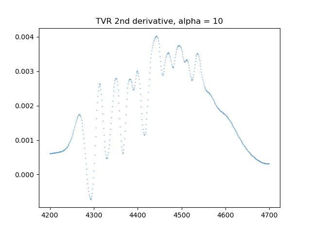
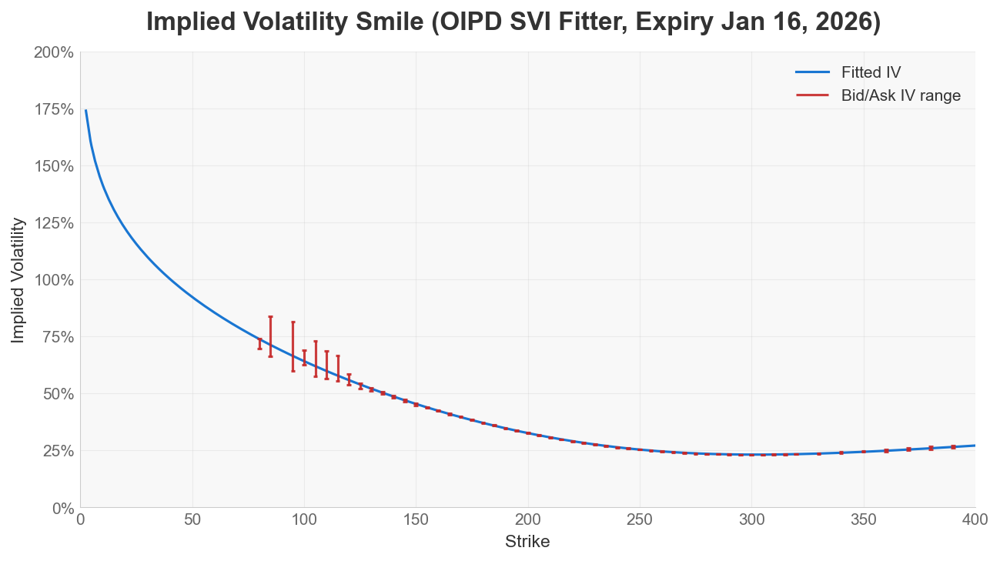

# Advanced Theory Overview

This page documents the full pipeline and implementation that OIPD uses. 

## 1. End-to-end pipeline

This represents a non-exhaustive, step-by-step pipeline to fit a volatility surface, and subsequently convert it to probability distribution. We've documentated the major steps below, as well as explaining OIPD's implementation. 

## 2. OIPD vs open-source and commercial volatility fitting libraries

OIPD is an end-to-end opinionated volatility surface fitting pipeline, which handles the data plumbing and cleaning, smile/surface fitting, and probability conversion all in one interface. 

Other open-source packages, such as Quantlib, are very strong building-block libraries which provide certain components of the pipeline, but requires a sophisticated user to understand the complete end-to-end wiring. Comparing the SVI fitter specifically, Quantlib has a much faster algorithm as it is written in C++, but its fitter is not constrained to be arbitrage-free. This is why we decided to implement our own SVI fitter. 

OIPD is (or at least aims to be) conceptually closer to commercial libraries like Vola Dynamics than to low-level libraries like QuantLib: it offers an integrated, configurable pipeline for fitting and probability extraction.

## 3. Validating OIPD's SVI fitter

To benchmark OIPD's SVI fitter, we compare it against a trusted reference: QuantLib's SVI fitter (`SviInterpolatedSmileSection`). We keep OIPD's preprocessing and data-cleaning pipeline fixed, and only swap the SVI calibration step.

The fitted smiles below are shown side by side using the same AAPL dataset and expiry.

<table align="center" cellspacing="12" style="margin-top:10px; width:100%; border-collapse:separate;">
  <tr>
    <td style="width:50%;">
      
      
OIPD SVI fitter

    </td>
    <td style="width:50%;">
      
      
QuantLib SVI fitter (OIPD preprocessing + QuantLib calibration)

    </td>
  </tr>
</table>

To compare a few metrics:
- full pipeline run time
- vega-weighted RMSE
- butterfly arbitrage checks, using 2 checks to detect arbitrage: (1) min(g(k)) and (2) negative density

We find that QuantLib's SVI fitter is significant faster, while OIPD ensures no-arbitrage. 

| Metric | OIPD SVI fitter | QuantLib SVI fitter |
| --- | --- | --- |
| Full pipeline runtime (mean seconds, 10 runs) | 1.1089 | 0.3647 |
| SVI calibration runtime (mean seconds, 10 runs) | 0.6970 | 0.000374 |
| Vega-weighted RMSE (IV) | 0.01057 | 0.00447 |
| min(g(k)) butterfly check | +0.0820 | -0.0383 |
| Share of grid with g(k) < 0 | 0.00% | 42.26% |
| Negative RND grid points (native 200-point RND grid) | 0 | 14 |

For arbitrage checks, higher `min(g(k))` is better, and any negative value is a warning for butterfly arbitrage. Likewise, lower values are better for both `Share of grid with g(k) < 0` and `Negative RND grid points`; `0` is the clean no-violation outcome on the tested grid.
